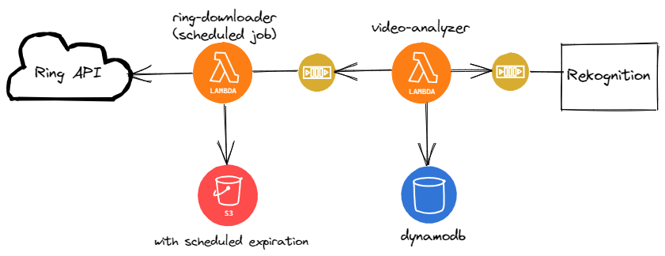

# ring-downloader
This service periodically checks for new videos recorded by Ring doorbell / spotlight camera and saves them in an S3 bucket, to be consumed for analysis by [video-analyzer](https://github.com/sharathgopinath/video-analyzer).

### References
* https://github.com/tchellomello/python-ring-doorbell
